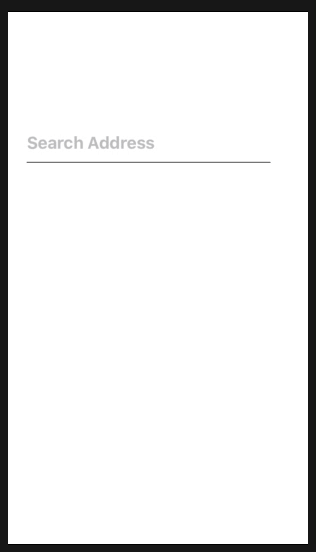

# Place Picker Using Google Places
An easy to use fully custmizable place picker that is inspired by Google 




## Installation


### Download file `AddressTextField` and copy-paste into your project.


## How to use it

### firstly need to integrate [Google Places](https://developers.google.com/places/ios-sdk/start)

### then add below line into `didFinishLaunchingWithOptions` of  `AppDelegate` 

```
GMSPlacesClient.provideAPIKey(GoogleAPIKey)
```
### assign `AddressTextField` class to your text field into storyboard.

### also paste below code in your viewcontroller class and get complete object of place.

```
txtSearch.itemSelectionHandler = {selectedIem in
    self.txtSearch.attributedText = selectedIem.attributedPrimaryText
    
}
```
